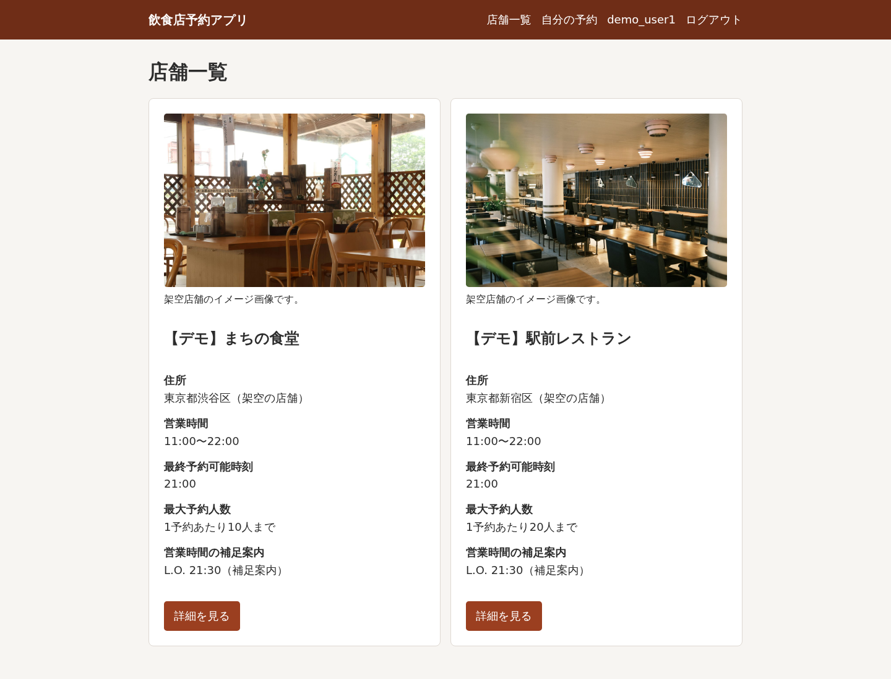
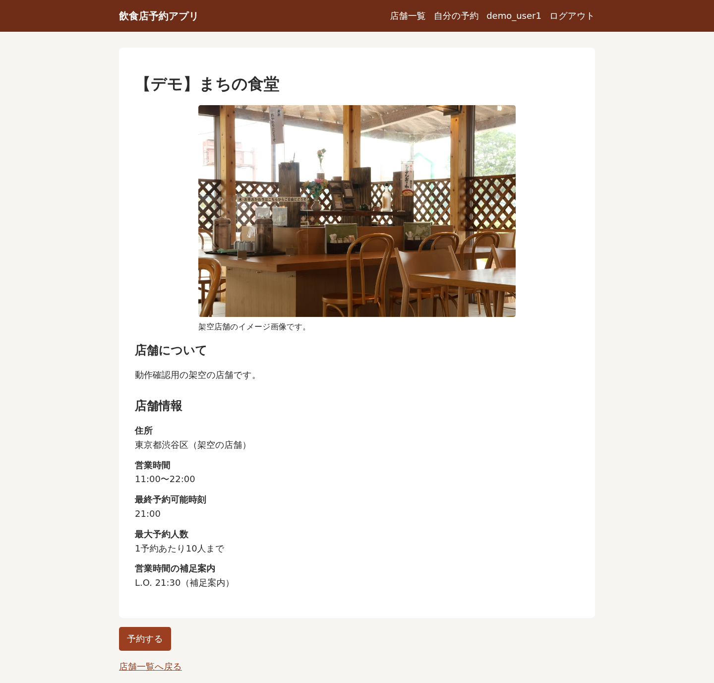
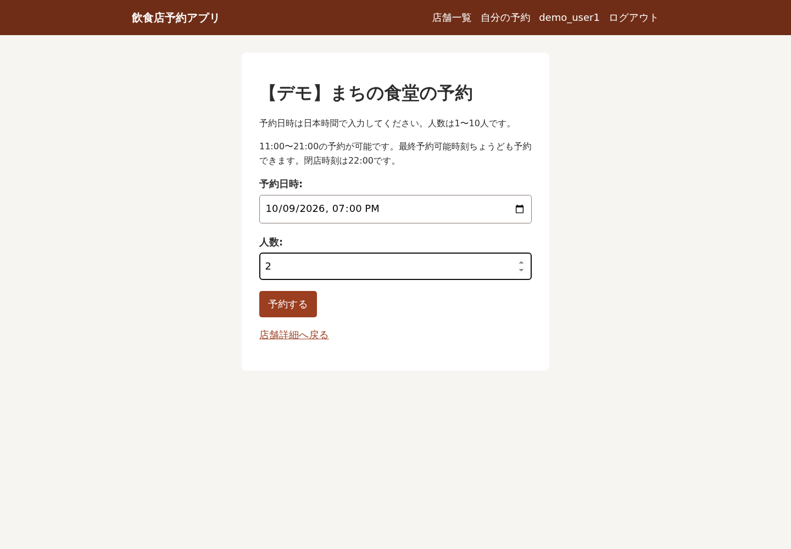
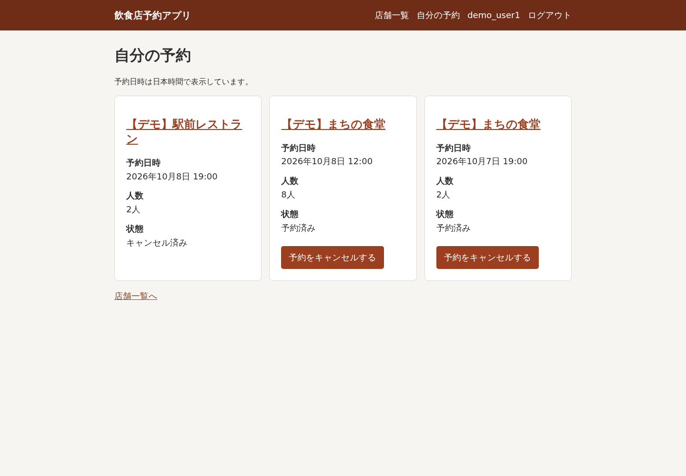
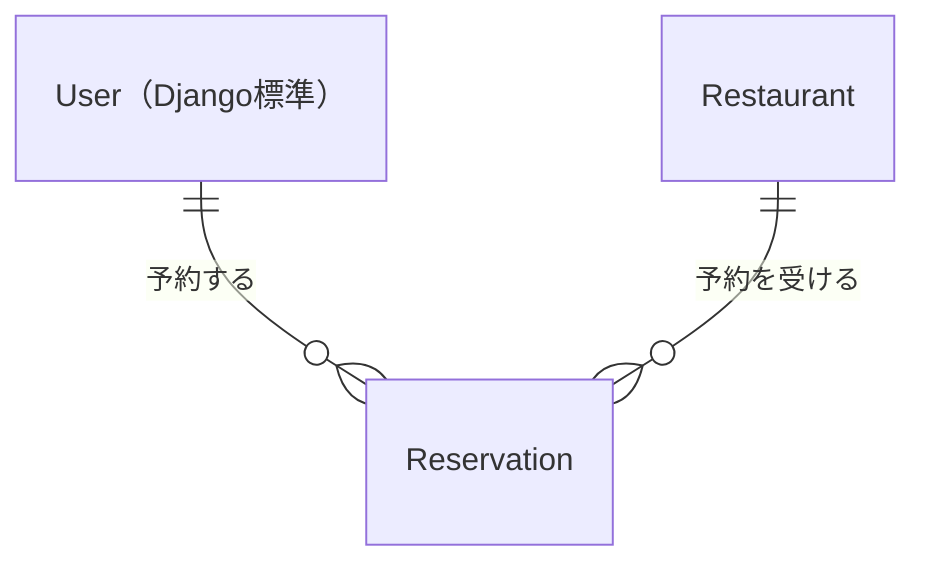

# 飲食店予約Webアプリ

## 概要

DjangoとMySQLで構築した飲食店予約アプリです。
店舗情報を閲覧し、会員登録・ログイン後に予約の作成やキャンセルができます。
HTML画面と予約JSON APIを提供します。

## 開発目的

PythonによるWeb開発を学ぶために作成しました。
Djangoの認証・ORM・フォーム・テンプレート・管理画面と、DRFによるAPIを使い、
入力検証、本人限定の操作、予約履歴の保持を実装しています。

## 主な機能

- 店舗一覧・詳細の閲覧（ログイン不要）
- 会員登録・ログイン・ログアウト
- 店舗別の予約可能時間・最大人数に応じた予約作成（日本時間）
- 自分の予約一覧と、開始前の予約済み予約のキャンセル
- 過去・キャンセル済みの予約履歴の保持
- 予約JSON API（一覧・作成・論理キャンセル）
- Django管理画面による店舗管理

## スクリーンショット

デモ店舗の写真は架空店舗のイメージ画像です。写真は静的ファイルとして同梱し、通常店舗は「画像なし」を表示します。
[写真の出典・ライセンス](docs/image-credits.md)を参照してください。画像アップロード機能はありません。

### 店舗一覧

予約可能なデモ店舗2件を表示しています。



### 店舗詳細

デモ店舗の営業時間・最終予約可能時刻・最大予約人数を確認できます。



### 予約作成

日本時間の日時と人数を入力するフォームです。



### 自分の予約一覧

`demo_user1`の予約済み・キャンセル済みの履歴です。



## 技術スタック・選定理由

| 技術 | バージョン・用途 |
| --- | --- |
| Python | 3.13 |
| Django | 5.2系：Webアプリ・認証・ORM・管理画面 |
| Django REST Framework | 3.18系：予約JSON API |
| MySQL | 8.4：データ保存 |
| mysqlclient | DjangoからMySQLへの接続 |
| Docker / Docker Compose | ローカル開発環境 |

Python依存関係の範囲は`requirements.txt`に記載しています。

今回の学習目的に対する採用理由は次のとおりです。

- **Python / Django**：PythonによるWeb開発を学ぶために採用しました。認証・ORM・フォーム・管理画面を標準機能で揃えられるため、予約機能と入力検証の実装に集中できます。
- **MySQL**：ユーザー・店舗・予約の関連を外部キーで表し、RDBによるデータ管理を学ぶために使用しています。
- **Django REST Framework**：Djangoのモデル・認証を活用しながら、Serializerによる入力検証を備えたJSON APIの開発を学べるため使用しています。
- **Docker Compose**：WebアプリとDBをまとめて起動でき、ホスト環境への依存を減らして開発環境を再現しやすくするため使用しています。

## ER図



各予約は1人のユーザーと1つの店舗に属し、ユーザーと店舗はそれぞれ複数の予約を持てます。
詳細なモデル定義は[設計書](docs/design.md#データ)を参照してください。

## 実装上の工夫

- **予約バリデーションの共通化**：HTMLフォームとJSON APIで、日時形式・未来日時・店舗別の予約可能時間・人数上限の検証関数を共有しています。
- **本人限定の操作**：予約一覧・キャンセル対象をログイン中のユーザーで絞り込み、他人の予約を閲覧・操作できないようにしています。
- **履歴の保持**：キャンセルは予約を削除せず、状態を更新します。過去・キャンセル済みの予約も履歴として残します。
- **安全なデモ投入**：`seed_demo`はローカル環境に限定し、再実行時は既存データを更新しません。識別情報の衝突時には停止します。

## セットアップ・デモアカウント

DockerとDocker Compose v2が必要です。以降のコマンドはリポジトリのルートで実行します。

```bash
git clone https://github.com/shimodum/restaurant-reservation-app.git
cd restaurant-reservation-app
cp .env.example .env
```

`.env`の`DJANGO_SECRET_KEY`、`MYSQL_PASSWORD`、`MYSQL_ROOT_PASSWORD`を任意の値に変更してください。
`.env`はGit管理対象外です。`MYSQL_HOST=db`はそのまま使用します。
この環境はローカル開発用です。

```bash
docker compose up -d --build
docker compose exec web python manage.py migrate
docker compose exec web python manage.py seed_demo
docker compose exec web python manage.py check --database default
```

http://localhost:8000/ を開きます。
`seed_demo`でデモ店舗2件とサンプル予約4件を投入します。空のDBから構築した場合、店舗一覧はこの2件です。既存店舗はそのまま残ります。
次の一般ユーザーでログインし、「自分の予約」で本人の予約済み・キャンセル済み予約を確認できます。

| ユーザー名 | パスワード |
| --- | --- |
| `demo_user1` | `demo1234` |
| `demo_user2` | `demo1234` |

初回投入時の翌日以降の19:00に予約を用意します。
もう一方のユーザーでログインすると、本人限定の一覧を確認できます。
デモユーザーには管理者権限がありません。

### 動作確認

1. Docker起動・Migration後、上記の`seed_demo`でデモデータを投入します。最初に管理画面で店舗を作成する必要はありません。
2. `demo_user1`でログインし、店舗一覧・詳細、予約作成、自分の予約一覧、開始前の予約のキャンセルを確認します。
3. 店舗追加も確認する場合は、`docker compose exec web python manage.py createsuperuser`で管理者を作成し、`/admin/`から店舗を追加します（任意）。デモ用管理者は用意していません。
4. 追加した店舗の開店・最終予約可能・閉店時刻と最大予約人数を設定し、店舗一覧への表示と予約作成を確認します。

`seed_demo`は`DEBUG=True`かつ`ALLOWED_HOSTS`が`localhost`・`127.0.0.1`のみの環境専用です。
再実行しても追加・更新・削除は行わず、予約日時や操作後の状態も保持します。
識別情報の衝突・欠落時は停止します。過去になった予約日時は更新しないため、新しい予約は画面から作成してください。
識別方法の詳細は[設計書](docs/design.md#デモデータ投入)を参照してください。

店舗の開店・最終予約可能・閉店時刻は日本時間・分単位で、
`開店時刻 < 最終予約可能時刻 < 閉店時刻`となるよう設定します。
例：開店11:00、最終予約21:00、閉店22:00、最大予約人数20。
3時刻をすべて空欄にすると新規予約の受付を停止します。一部だけの設定はできません。
営業時間の補足案内に記載するL.O.は、予約可能時刻の自動判定には使用しません。

既存環境の更新時もビルドと`migrate`を実行してください。

通常の起動・停止：

```bash
docker compose up -d
docker compose down
```

DBデータは`mysql_data`ボリュームに保持されます。`docker compose down -v`はDBデータも削除します。
初回作成後に`.env`のMySQLパスワードを変更しても、既存DBの認証情報は変わりません。

## 主要URL

ベースURL： http://localhost:8000

| 画面・操作 | パス | 条件 |
| --- | --- | --- |
| ホーム | `/` | ログイン不要 |
| 店舗一覧 | `/restaurants/` | ログイン不要 |
| 店舗詳細 | `/restaurants/<id>/` | ログイン不要 |
| 会員登録 | `/accounts/signup/` | ユーザー名・パスワードを登録 |
| ログイン | `/accounts/login/` | 登録済みの会員 |
| 予約作成 | `/restaurants/<id>/reserve/` | ログイン必須 |
| 自分の予約 | `/reservations/` | ログイン必須 |
| 予約キャンセル | `/reservations/<id>/cancel/` | POST・本人のみ |
| ログアウト | `/accounts/logout/` | POST |
| 管理画面 | `/admin/` | 管理者権限 |

`<id>`は店舗または予約のIDです。画面のPOST操作はボタンから行います。

## API仕様

既存の `/accounts/login/` でログインしたセッションCookieを使用します。
POST・DELETEには、セッションCookieに加えて`X-CSRFToken`ヘッダーが必要です。
POSTの`Content-Type`は`application/json`を指定します。
JWT・Token・Basic認証、API専用ログイン、Browsable APIは提供しません。

| メソッド | パス | 成功時 |
| --- | --- | --- |
| GET | `/api/reservations/` | 200：本人の全予約履歴の配列（空なら`[]`） |
| POST | `/api/reservations/` | 201：作成した予約 |
| DELETE | `/api/reservations/<id>/` | 204：本文なし、状態を`cancelled`へ更新 |

一覧は予約日時の降順（同日時はID降順）です。staffも本人の予約だけが対象です。
DELETEは物理削除せず、履歴を残します。開始前の予約済み予約だけキャンセルできます。

### 作成時の入力

| 項目 | 条件 |
| --- | --- |
| `restaurant` | 必須。実在する店舗IDをJSON整数で指定 |
| `reserved_at` | 必須。日本時間の未来日時を`YYYY-MM-DDTHH:MM`形式で指定。秒・タイムゾーン・前後の空白は不可 |
| `party_size` | 必須。1〜店舗の最大予約人数の整数（APIの検証上限は32767） |

予約時刻は店舗の開店〜最終予約可能時刻の範囲内で、両端を含みます。
予約設定が未完了・不正な店舗は受け付けません。L.O.の補足案内は判定に使用しません。
利用者と初期状態`confirmed`はサーバー側で設定します。

リクエスト例（店舗ID・日時は利用時の条件に合わせて変更）：

```json
{
  "restaurant": 1,
  "reserved_at": "2030-01-11T19:00",
  "party_size": 2
}
```

出力項目・応答例は[設計書](docs/design.md#apiの入出力詳細)、エラー時のHTTPステータスと条件は[主なエラー](docs/design.md#主なエラー)を参照してください。

## テスト

### 初回のテストDB権限設定

自動テストは開発DBとは別の`test_restaurant_reservation`を作成し、終了後に削除します。
`.env.example`と同じDB名・ユーザー名を使用する場合、初回に以下の権限を追加してください。
変更している場合は設定に合わせて読み替えます。開発DBをテストDBに指定しないでください。

```bash
docker compose exec db mysql -u root -p
```

初回構築時の`MYSQL_ROOT_PASSWORD`を入力し、MySQLで次を実行します。

```sql
GRANT ALL PRIVILEGES ON `test\_restaurant\_reservation`.* TO 'restaurant'@'%';
SHOW GRANTS FOR 'restaurant'@'%';
exit
```

`\_`はDB名の`_`を文字として扱う指定です。権限はテストDBに限定し、通常は初回だけ設定します。

### 実行コマンド

```bash
docker compose exec web python manage.py test
docker compose exec web python manage.py check --database default
docker compose exec web python manage.py makemigrations --check --dry-run
```

認証・本人限定操作・日時と人数の境界・店舗設定・CSRF・履歴保持・削除保護・Migration・APIを確認します。
デモ投入コマンドのテストのみ実行する場合は`docker compose exec web python manage.py test reservations.tests_seed_demo`を使用します。
APIのみ実行する場合は`docker compose exec web python manage.py test reservations.tests_api`を使用します。

### 動作確認結果

以下はこれまでの確認結果です。今回の文章調整ではテストを再実行していません。

- Docker環境で全86件の自動テストが成功。
- Djangoのシステムチェック・DBチェックは問題なし、Migration差分チェックは差分なし。
- 予約APIのGET・POST・DELETE、未ログイン時の403、不正店舗IDの400をブラウザで確認済み（全ケースの手動確認ではありません）。
- 店舗一覧・詳細・予約作成・自分の予約一覧を1440px・375px・320pxで表示確認済み。
- 別環境での初回セットアップは未検証。

## 設計書・対象外機能

モデル・ER図・予約ルール・実装構成は[設計書](docs/design.md)を参照してください。

### 対象外機能

- 曜日別営業時間・定休日・日をまたぐ営業時間・営業時間帯の分割・滞在時間
- 席数・予約枠・満席判定・重複予約の判定
- 店舗検索・ページネーション・レビュー・お気に入り
- 決済・メール通知・店舗オーナー機能・管理画面での予約管理
- JavaScriptによる非同期処理・本格的なデザイン変更・ファビコン・デプロイ

予約情報を登録するMVPであり、実店舗の空席を保証する仕組みは提供していません。
