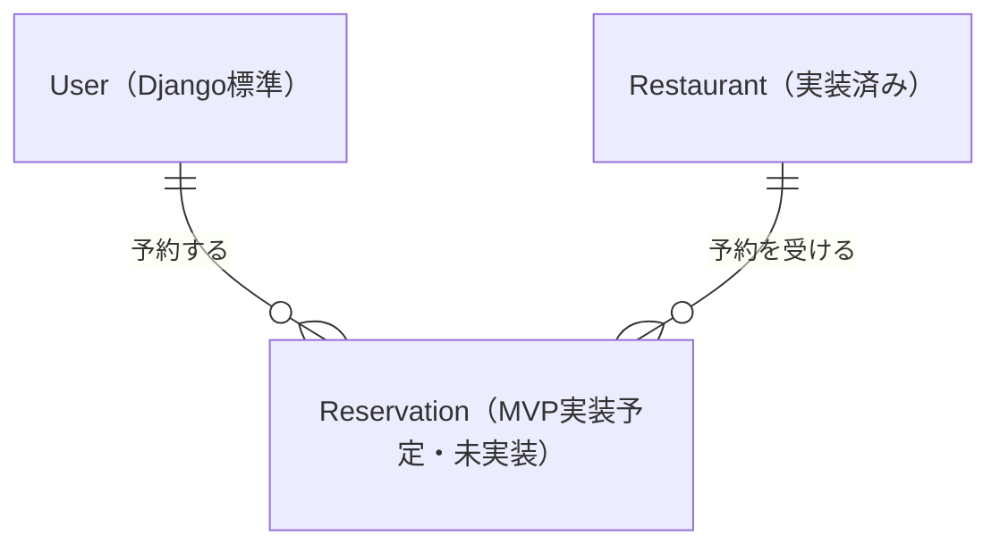

# MVP設計

## 方針

Django標準のモデル・フォーム・テンプレート・認証・管理画面を使う。
まずは複数店舗の閲覧と予約ができる最小構成を作る。
画面はサーバー側で生成し、APIやJavaScriptフレームワークは導入しない。
この文書は初期案であり、店舗モデル・管理画面・店舗一覧と詳細まで実装済み。
予約と認証に関する業務機能はまだ未実装。

## 機能と画面

| 利用者 | 機能 | URL案 |
| --- | --- | --- |
| 誰でも | 店舗一覧・詳細 | `/restaurants/`, `/restaurants/<id>/` |
| 誰でも | 会員登録・ログイン | `/accounts/signup/`, `/accounts/login/` |
| ログイン済み | ログアウト（POST） | `/accounts/logout/` |
| ログイン済み | 予約作成 | `/restaurants/<id>/reserve/` |
| ログイン済み | 自分の予約一覧 | `/reservations/` |
| ログイン済み | 自分の予約キャンセル（POST） | `/reservations/<id>/cancel/` |
| 管理者 | 店舗・予約の管理 | `/admin/` |

検索、レビュー、お気に入り、決済、メール通知、店舗オーナー権限は対象外。
認証は標準Userと認証ビューを使い、会員登録にはUserCreationFormを使う。

## データ

| モデル | 主な項目 |
| --- | --- |
| User（Django標準） | ユーザー名、パスワードなど |
| Restaurant | 店名、説明、住所、営業時間の案内文 |
| Reservation | 利用者（外部キー）、店舗（外部キー）、予約日時、人数、状態、作成日時 |

UserとRestaurantそれぞれに対し、Reservationは多対一。
予約状態は「予約済み」「キャンセル済み」の2種類とする。
予約履歴を残すため、キャンセルは状態の更新とし、店舗削除は予約があれば保護する。
利用者削除の運用はMVPでは提供しない。

### ER図

MVPで予定しているモデル間の関係を示す概念ER図です。項目は上のデータ表を参照してください。
UserはDjango標準モデル、Restaurantは実装済みです。
ReservationはMVPで実装予定のモデルであり、モデル・テーブルともに未実装です。

`||`は「必ず1件」、`o{`は「0件以上」を表します。
1人のUserと1つのRestaurantはそれぞれ0件以上のReservationを持ち、
各Reservationは必ず1人のUserと1つのRestaurantに属します。

## 初期の予約ルール

- ログインした利用者だけが予約できる。
- 日時は未来、人数は1〜10名とする（初期案）。
- 閲覧・キャンセル対象は必ずログイン中の利用者で絞る。
- キャンセルできるのは開始前の予約済み予約のみ。
- 作成・キャンセルにはPOSTとDjangoのCSRF保護を使う。
- 日本時間で入力・表示し、Djangoのタイムゾーン対応を使う。

このMVPは予約情報の登録を目的とする。席数、予約枠、重複・満席判定、
営業時間による受付制限は扱わない。実店舗で空席を保証する運用には、
これらのルール設計と同時予約への対策が別途必要。

## 構成と実装順序

`config`はプロジェクト設定、`reservations`は店舗・予約の業務処理を担当する。
サービス層やリポジトリ層は作らず、まずはモデル・フォーム・ビューで実装する。

1. 設計、DjangoとMySQLの開発環境（今回）。
2. 店舗モデル、管理画面、店舗一覧・詳細（実装済み）。
3. 会員登録、ログイン・ログアウト。
4. 予約モデル、予約作成、本人の予約一覧・キャンセル。
5. 権限、入力検証、予約操作のテスト。
