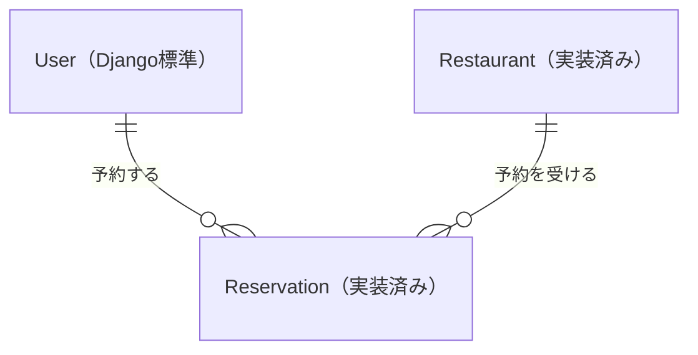

# MVP設計

## 方針

Django標準のモデル・フォーム・テンプレート・認証・管理画面を使う。
まずは複数店舗の閲覧と予約ができる最小構成を作る。
画面はサーバー側で生成し、APIやJavaScriptフレームワークは導入しない。
店舗モデル・管理画面・店舗一覧と詳細、会員登録・ログイン・ログアウトは実装済み。
予約モデル・予約作成・自分の予約一覧・キャンセルも実装済み。

## 機能と画面

| 利用者 | 機能 | URL |
| --- | --- | --- |
| 誰でも | 店舗一覧・詳細 | `/restaurants/`, `/restaurants/<id>/` |
| 誰でも | 会員登録・ログイン | `/accounts/signup/`, `/accounts/login/` |
| ログイン済み | ログアウト（POST） | `/accounts/logout/` |
| ログイン済み | 予約作成 | `/restaurants/<id>/reserve/` |
| ログイン済み | 自分の予約一覧 | `/reservations/` |
| ログイン済み | 自分の予約キャンセル（POST） | `/reservations/<id>/cancel/` |
| 管理者 | 店舗の管理（予約管理は未実装） | `/admin/` |

検索、レビュー、お気に入り、決済、メール通知、店舗オーナー権限は対象外。
認証は標準Userと認証ビューを使い、会員登録にはUserCreationFormを使う。
登録項目はユーザー名・パスワード・確認用パスワードとする。
登録成功後はログイン画面へ移動し、自動ログインはしない。
ログイン・ログアウト後は、nextの指定にかかわらずホームへ移動する。
ログイン済みで登録・ログイン画面へアクセスした場合もホームへ移動する。
共通ヘッダーには未ログイン時に会員登録・ログイン、ログイン時にユーザー名・
自分の予約一覧へのリンク・POSTフォームのログアウトボタンを表示する。店舗閲覧はログイン不要とする。

## データ

| モデル | 主な項目 |
| --- | --- |
| User（Django標準） | ユーザー名、パスワードなど |
| Restaurant | 店名、説明、住所、営業時間の案内文 |
| Reservation | 利用者（外部キー）、店舗（外部キー）、予約日時、人数、状態、作成日時 |

UserとRestaurantそれぞれに対し、Reservationは多対一。
予約状態は「予約済み」「キャンセル済み」の2種類とする。
予約履歴を残すため、キャンセルは状態の更新とし、User・Restaurantは予約があれば`PROTECT`で削除を保護する。
キャンセル済み予約も削除保護の対象とする。
利用者削除の運用はMVPでは提供しない。

### ER図

実装済みのモデル間の関係を示す概念ER図です。UserはDjango標準モデルです。

```mermaid
erDiagram
    User ||--o{ Reservation : "予約する"
    Restaurant ||--o{ Reservation : "予約を受ける"
    User["User（Django標準）"]
    Restaurant["Restaurant（実装済み）"]
    Reservation["Reservation（実装済み）"]
```

`||`は「必ず1件」、`o{`は「0件以上」を表します。
1人のUserと1つのRestaurantはそれぞれ0件以上のReservationを持ち、
各Reservationは必ず1人のUserと1つのRestaurantに属します。

### Reservationのフィールド

| フィールド | 定義 |
| --- | --- |
| id | 自動生成のBigAutoField |
| user | settings.AUTH_USER_MODELへのForeignKey、PROTECT、related_name="reservations" |
| restaurant | RestaurantへのForeignKey、PROTECT、related_name="reservations" |
| reserved_at | DateTimeField、予約日時 |
| party_size | PositiveSmallIntegerField、MinValueValidator(1)・MaxValueValidator(10) |
| status | CharField(max_length=10)、TextChoices、初期値confirmed |
| created_at | DateTimeField(auto_now_add=True) |

状態は`Status.CONFIRMED`（`confirmed`／予約済み）と
`Status.CANCELLED`（`cancelled`／キャンセル済み）の2種類。
日時が過ぎても状態を自動変更しない。一覧は`-reserved_at, -pk`の順で、全履歴を表示する。
`can_cancel`プロパティは予約済みかつ`reserved_at > timezone.now()`を判定する。
`0002_reservation`は`0001_initial`と標準UserのMigrationに依存し、予約テーブルを追加する。
既存データの移行は不要。

## 予約ルール

- ログインした利用者だけが予約できる。
- 日時は未来、人数は1〜10名とする。
- 閲覧・キャンセル対象は必ずログイン中の利用者で絞る。
- キャンセルできるのは開始前の予約済み予約のみ。
- 作成・キャンセルにはPOSTとDjangoのCSRF保護を使う。
- 日本時間で入力・表示し、Djangoのタイムゾーン対応を使う。

このMVPは予約情報の登録を目的とする。席数、予約枠、重複・満席判定、
営業時間による受付制限は扱わない。実店舗で空席を保証する運用には、
これらのルール設計と同時予約への対策が別途必要。

## フォーム・View・画面

- 関数ベースViewに`login_required`を付ける。作成はGET・POST、一覧はGET、キャンセルはPOSTのみ。
- URL名は`reservations:reservation_create`、`reservations:reservation_list`、
  `reservations:reservation_cancel`。既存の店舗URL・URL名は維持する。
- ReservationFormはModelFormで、入力項目は`reserved_at`・`party_size`だけ。
  日時は`datetime-local`を使用し、`%Y-%m-%dT%H:%M`の分単位で日本時間として入力する。
- 未来日時の検証はフォームの`clean_reserved_at()`で行う。人数の範囲はモデルのvalidatorを
  ModelForm経由で適用する。必須・日時形式・整数の検証は標準フォームを使う。
  HTMLにも人数のmin・maxを指定するが、サーバー側で必ず検証する。
- モデルの`save()`はvalidatorを自動実行しない。日時の未来判定をモデルの`clean()`には置かず、
  過去の履歴保持・キャンセルを妨げない。独自saveや追加のDB制約は導入しない。
- 作成は`form.save(commit=False)`後、Userを`request.user`、RestaurantをURLから設定する。
  状態はモデルの初期値を使用する。POSTされたUser・Restaurant・statusは採用しない。
- 一覧は`filter(user=request.user).select_related("restaurant")`で取得する。
  キャンセルは`get_object_or_404(Reservation, pk=pk, user=request.user)`で取得し、
  他人の予約・存在しない予約はともに404。存在しない店舗への作成も404。
- キャンセルは処理時に`can_cancel`を再確認し、statusだけを更新する。期限切れ・取消済みは
  更新せず理由を案内する。ログイン済みのGETによるキャンセルは405。
- 作成成功・キャンセル処理後は一覧へリダイレクトし、Django messagesで結果を表示する。
  入力エラー時はフォームの値とエラーを再表示する。
- 店舗詳細から予約フォームへ進み、共通ヘッダーから自分の予約一覧へ進む。
  未ログイン時はログインへ誘導するが、ログイン後はホームへ戻り、店舗を選び直す。
- 予約一覧に店舗名・日本時間の日時・人数・日本語の状態を表示する。
  キャンセル可能な予約のみCSRF付きPOSTボタンを表示し、確認画面は挟まない。
  空の一覧には案内と店舗一覧リンクを表示する。ページ分割は追加しない。
- 共通テンプレート・既存のフォームとカードのCSSを再利用する。
  JavaScript、API、Reservationの管理画面登録は追加しない。

## テスト

固定時刻で未来・現在・過去の境界を検証する。人数1・10の正常系と範囲外・不正入力、
本人限定の一覧・キャンセル、POST値の改ざん、GETで変更されないこと、履歴の保持・削除保護、
並び順・日本時間表示・導線を自動テストする。CSRFは`Client(enforce_csrf_checks=True)`で
トークンなしの拒否と有効なトークンの成功を確認する。既存店舗・認証テストも維持する。

## 構成と実装順序

`config`はプロジェクト設定、`reservations`は店舗・予約の業務処理を担当する。
`accounts`は会員登録と標準認証ビューへのURL設定を担当する。
サービス層やリポジトリ層は作らず、まずはモデル・フォーム・ビューで実装する。

1. 設計、DjangoとMySQLの開発環境（実装済み）。
2. 店舗モデル、管理画面、店舗一覧・詳細（実装済み）。
3. 会員登録、ログイン・ログアウト（実装済み）。
4. 予約モデル、予約作成、本人の予約一覧・キャンセル（実装済み）。
5. 権限、入力検証、予約操作のテスト（実装済み）。
